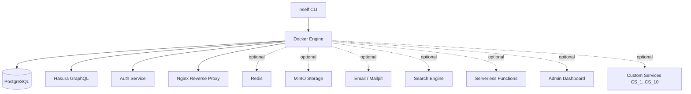

# Architecture

## Contents

- [System Overview](#system-overview)
- [Core Services](#core-services)
- [Data Flow](#data-flow)
- [Service Isolation](#service-isolation)
- [Optional Services](#optional-services)
- [Custom Services](#custom-services)

ɳSelf spins up a complete self-hosted backend in approximately five minutes. The CLI reads your project configuration, generates a Docker Compose file, and orchestrates all services automatically, you never write a compose file by hand. Postgres, Hasura, Auth, and Nginx are wired together and ready to accept connections the moment `nself start` completes.

## System Overview



## Core Services

These four services are always present. Every ɳSelf project runs them.

### PostgreSQL (`postgres:16-alpine`, port 5432)

The primary database for all project data. ɳSelf initialises it with three extensions enabled by default: `uuid-ossp` for UUID generation, `pgcrypto` for password hashing and encryption primitives, and `pg_trgm` for trigram-based full-text search. Hasura and Auth both connect to this instance, there is one Postgres, not two.

The `alpine` variant keeps the image small without sacrificing any functionality the stack needs.

### Hasura GraphQL (`hasura/graphql-engine:v2.44.0`, port 8080)

Hasura introspects your Postgres schema and instantly exposes a GraphQL API, no resolver code required. It handles subscriptions, relationships, permissions (row-level and column-level), and migrations. The API port is internal only; external clients reach it through Nginx.

Hasura is the reason you don't need a custom API layer for CRUD operations. You write database migrations and permission rules; Hasura handles the rest.

### Auth (`nhost/hasura-auth:0.36.0`, port 4000)

A purpose-built authentication service that integrates directly with Hasura's permission system. It supports JWT sessions, OAuth (Google, GitHub, and others), magic links, OTPs, and passwordless flows out of the box. User records live in Postgres alongside your application data, no separate auth database.

Because Auth and Hasura share the same Postgres instance, joining user records with application data is a native GraphQL relationship, not a cross-service API call.

### Nginx (`nginx:alpine`, ports 80/443)

The single entry point for all external traffic. Nginx terminates SSL, enforces rate limiting, and reverse-proxies requests to the correct internal service. It is the only service with ports exposed to the network, everything else is bound to `127.0.0.1`.

ɳSelf auto-generates the Nginx configuration from your project settings. You do not write `nginx.conf` by hand.

## Data Flow

All external traffic enters through Nginx on port 443 (HTTP on 80 redirects to HTTPS). From there:

- **GraphQL API:** Browser → Nginx (443) → Hasura (:8080) → PostgreSQL (:5432)
- **Authentication:** Browser → Nginx (443) → Auth (:4000) → PostgreSQL (:5432)
- **File uploads:** Browser → Nginx (443) → MinIO (:9000), when storage is enabled

Internal services communicate with each other over Docker's bridge network using their service names as hostnames. No internal traffic leaves the host.

## Service Isolation

Every internal service, Postgres, Hasura, Auth, and all optional services, binds exclusively to `127.0.0.1`. They are not reachable from outside the host at all. External access goes through Nginx, which means rate limiting and SSL enforcement apply to every request regardless of which backend service ultimately handles it. A vulnerability in Hasura or Auth cannot be exploited directly from the network without first passing through Nginx.

This also means you can run ɳSelf on a server with a minimal firewall: open ports 80 and 443, close everything else.

## Optional Services

Enable additional services by setting the corresponding environment variable in your project `.env` file and running `nself build` followed by `nself restart`.

| Service | Toggle | Purpose |
|---------|--------|---------|
| Redis | `REDIS_ENABLED=true` | Caching, sessions, job queues |
| MinIO | `MINIO_ENABLED=true` | S3-compatible object storage |
| Email | `MAILPIT_ENABLED=true` | Email testing (Mailpit in dev) / SMTP relay in prod |
| Search | `SEARCH_ENABLED=true` | Full-text search (MeiliSearch or Typesense) |
| Functions | `FUNCTIONS_ENABLED=true` | Serverless runtime |
| Admin | `NSELF_ADMIN_ENABLED=true` | Local GUI dashboard (localhost:3021) |

None of these are enabled by default. Add only what your project needs, a smaller compose file means faster cold starts and easier debugging.

## Custom Services

ɳSelf reserves ten slots for user-defined services: `CS_1` through `CS_10`. Each slot takes a single string in the format `name:template:port:route`. The CLI reads these values, pulls the matching service template, and injects it into the generated compose file alongside your core services.

```bash
# Example: add a Rust ping API as CS_1
CS_1=ping_api:rust-axum:8001:/ping
```

Custom services follow the same isolation rules as built-in services: they bind to `127.0.0.1` and are only reachable externally through Nginx at the route you specify.

## Plugin Installer Security Model

The plugin installer (`internal/plugin/installer.go`) enforces a layered security model:

**Signature verification.** Every stable plugin tarball is verified against an Ed25519 signature embedded in the plugin registry. The public key is pinned at install time; it is never fetched at verify time to prevent TOCTOU attacks.

**Bypass controls.** Two environment variables can bypass signature verification in development only:

- `NSELF_LICENSE_SKIP_VERIFY=1` — requests a skip.
- `NSELF_LICENSE_SKIP_VERIFY_FORCE=1` — must accompany the first var; standalone skip is rejected.

Both vars must be set together. Either var alone is a hard error.

**Production and staging block.** When `NSELF_ENV` is `prod` or `staging`, the installer rejects any bypass attempt with a `SECURITY:` prefixed error and exits non-zero. The install is aborted before any file is written.

**Dev bypass audit log.** When bypass is used in a `dev` environment, the installer writes a structured JSON entry to `~/.nself/audit.log` via `internal/audit.Write`. Each entry contains:

| Field | Description |
|---|---|
| `event` | Always `plugin-install-bypass` |
| `plugin` | Plugin name being installed |
| `reason` | Both env var names that triggered the skip |
| `uid` | `$USER` at install time |
| `env` | Current `NSELF_ENV` value |
| `timestamp` | RFC3339 UTC timestamp |

The audit log is created with `0600` permissions and is append-only.

---
← [[Home]] | [[_Sidebar]]
