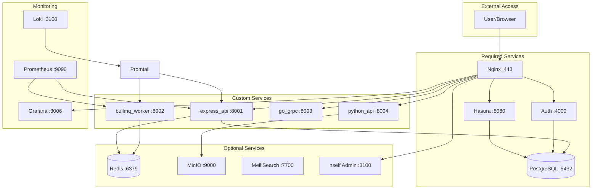

# nself Demo Setup - Complete Reference

The demo setup (`nself init --demo`) provides a fully-featured Backend-as-a-Service environment with all major components enabled. This configuration showcases the complete capabilities of nself.

## Quick Start

```bash
# Initialize demo project
nself init --demo

# Build all services
nself build

# Start everything
nself start

# View running services
docker ps --format "table {{.Names}}\t{{.Status}}\t{{.Ports}}"
```

## Complete Service Inventory (24 Services)

### 🏗️ Required Core Services (4)

These form the foundation of every nself deployment:

1. **PostgreSQL** - Primary database
   - Latest v16 with all extensions
   - pgvector for AI/ML embeddings
   - PostGIS for geospatial data
   - Full-text search capabilities

2. **Hasura** - GraphQL API Engine
   - Instant GraphQL APIs
   - Real-time subscriptions
   - Row-level security
   - Remote schema stitching

3. **Auth** - Authentication Service
   - JWT-based authentication
   - Email/password login
   - Social providers ready
   - WebAuthn support

4. **Nginx** - Reverse Proxy
   - SSL termination
   - Load balancing
   - Route management
   - Static file serving

### 🔧 Optional Services Enabled (16)

#### Monitoring Bundle (10 services)
Complete observability stack enabled with `MONITORING_ENABLED=true`:

5. **Prometheus** - Metrics collection and storage
6. **Grafana** - Visualization and dashboards
7. **Loki** - Log aggregation system
8. **Promtail** - Log shipping agent
9. **Tempo** - Distributed tracing
10. **Alertmanager** - Alert routing
11. **cAdvisor** - Container metrics
12. **Node Exporter** - System metrics
13. **Postgres Exporter** - Database metrics
14. **Redis Exporter** - Cache metrics

#### Individual Optional Services (6)

15. **Redis** - In-memory data store
    - Session management
    - Caching layer
    - Pub/Sub messaging
    - Job queue backend

16. **MinIO** - S3-compatible storage
    - File uploads
    - Backup storage
    - ML model artifacts
    - Static assets

17. **Storage API** - File management service
    - Upload handling
    - Image transformations
    - Access control
    - CDN integration

18. **MailPit** - Email testing
    - Catches all emails
    - Web UI for viewing
    - API for testing
    - No emails sent externally

19. **MeiliSearch** - Full-text search
    - Typo-tolerant search
    - Faceted search
    - Multi-language support
    - Instant results

20. **nself Admin** - Management UI
    - Service monitoring
    - Configuration management
    - Database administration
    - Log viewing

### 🚀 Custom Services (4)

Demo includes four diverse custom services to showcase different architectures:

21. **express_api** - REST API Service
    - Express.js framework
    - RESTful endpoints
    - JWT authentication
    - PostgreSQL integration
    - Template: `express-js`
    - Port: 8001
    - Route: `https://api.<domain>`

22. **bullmq_worker** - Background Job Processor
    - BullMQ queue processing
    - Redis-backed jobs
    - Retry logic
    - Dead letter queue
    - Template: `bullmq-js`
    - Port: 8002
    - Internal service (no public route)

23. **go_grpc** - High-Performance gRPC Service
    - Go implementation
    - Protocol buffers
    - Bi-directional streaming
    - Service mesh ready
    - Template: `grpc`
    - Port: 8003
    - Route: `https://grpc.<domain>`

24. **python_api** - ML/Data API
    - FastAPI framework
    - Async/await support
    - OpenAPI documentation
    - ML model serving
    - Template: `fastapi`
    - Port: 8004
    - Route: `https://ml-api.<domain>`

## Service Configuration Details

### Custom Services Definition

The demo `.env` includes:

```bash
# Custom Backend Services
CUSTOM_SERVICES=express-api,bullmq-worker,go-grpc,python-api
CS_1=express_api:express-js:8001
CS_2=bullmq_worker:bullmq-js:8002
CS_3=go_grpc:grpc:8003
CS_4=python_api:fastapi:8004

# Service-specific configuration
CS_1_MEMORY=512M
CS_1_CPU=0.5
CS_1_ROUTE=api
CS_1_HEALTHCHECK=/health

CS_2_MEMORY=256M
CS_2_CPU=0.25
CS_2_QUEUE_NAME=demo-jobs

CS_3_MEMORY=256M
CS_3_CPU=0.5
CS_3_REPLICAS=2
CS_3_ROUTE=grpc

CS_4_MEMORY=512M
CS_4_CPU=0.5
CS_4_ROUTE=ml-api
```

### Service Communication Map



## Access URLs

After starting the demo, services are available at:

### Core Services
- GraphQL Playground: `https://api.local.nself.org`
- Authentication: `https://auth.local.nself.org`

### Custom Services
- REST API: `https://api.local.nself.org`
- gRPC Service: `https://grpc.local.nself.org`
- ML API: `https://ml-api.local.nself.org`
- API Documentation: `https://ml-api.local.nself.org/docs`

### Admin & Monitoring
- nself Admin: `https://admin.local.nself.org`
- Grafana: `https://grafana.local.nself.org`
- Prometheus: `https://prometheus.local.nself.org`
- Alertmanager: `https://alertmanager.local.nself.org`

### Development Tools
- Mail UI: `https://mail.local.nself.org`
- Search UI: `https://search.local.nself.org`
- MinIO Console: `https://storage-console.local.nself.org`

## Resource Usage

### Minimum Requirements (Demo)
- **CPU**: 4 cores
- **RAM**: 8GB
- **Disk**: 20GB
- **Network**: Local development

### Typical Usage (Running)
- **CPU**: ~2-3 cores utilized
- **RAM**: ~4-6GB active
- **Disk**: ~5GB after pulling images
- **Network**: Minimal (local only)

### Per-Service Breakdown

| Service Category | CPU | Memory | Storage |
|-----------------|-----|--------|---------|
| Core (4) | 1.5 cores | 2GB | 2GB |
| Monitoring (10) | 2 cores | 3GB | 5GB |
| Optional (6) | 1 core | 1.5GB | 3GB |
| Custom (4) | 1.5 cores | 1.5GB | 1GB |
| **Total** | **6 cores** | **8GB** | **11GB** |

## Demo Data & Examples

### Sample API Calls

```bash
# Test Express API
curl https://api.local.nself.org/health

# Test Python ML API
curl https://ml-api.local.nself.org/predict \
  -H "Content-Type: application/json" \
  -d '{"data": [1, 2, 3, 4, 5]}'

# GraphQL Query via Hasura
curl https://api.local.nself.org/v1/graphql \
  -H "Content-Type: application/json" \
  -H "x-hasura-admin-secret: demo-admin-secret" \
  -d '{"query": "{ users { id email } }"}'
```

### Queue Job Example

```javascript
// Submit job to BullMQ worker
const Queue = require('bull');
const demoQueue = new Queue('demo-jobs', {
  redis: {
    host: 'redis',
    port: 6379,
    password: 'demo-redis-password'
  }
});

await demoQueue.add('process-data', {
  userId: 123,
  action: 'generate-report'
});
```

### File Upload Example

```javascript
// Upload to MinIO via Storage API
const formData = new FormData();
formData.append('file', fileInput.files[0]);

fetch('https://storage.local.nself.org/upload', {
  method: 'POST',
  body: formData,
  headers: {
    'Authorization': 'Bearer <token>'
  }
});
```

## Monitoring & Observability

### Pre-configured Dashboards

The demo includes Grafana dashboards for:
- **System Overview** - All services at a glance
- **Container Metrics** - CPU, memory, network per container
- **PostgreSQL Performance** - Query performance, connections
- **Redis Metrics** - Hit rate, memory usage
- **API Performance** - Request rates, latencies
- **Custom Service Metrics** - Business metrics

### Log Aggregation

All services automatically ship logs to Loki:
```bash
# View logs in Grafana
# Navigate to: https://grafana.local.nself.org
# Go to Explore → Select Loki
# Query: {container="express_api"} |= "error"
```

### Distributed Tracing

Tempo collects traces from all services:
```bash
# Services automatically instrumented
# View traces in Grafana
# Useful for debugging request flow
```

## Customization

### Modifying Custom Services

After `nself build`, customize your services:

```bash
# Edit Express API
vim services/express_api/src/index.js

# Edit Python API
vim services/python_api/main.py

# Changes persist - won't be overwritten
nself build  # Safe to run again
```

### Adding More Services

```bash
# Add to .env
CS_5=websocket_server:socketio-js:8005
CS_6=temporal_worker:temporal-js:8006

# Rebuild
nself build

# Restart
nself restart
```

### Scaling Services

```bash
# Edit docker-compose.yml
# Under service definition:
deploy:
  replicas: 3

# Apply changes
nself restart
```

## Troubleshooting

### Services Not Starting

```bash
# Check status
nself status

# View logs
nself logs <service-name>

# Common issues:
# - Port conflicts
# - Database connection
# - Missing environment variables
```

### Performance Issues

```bash
# Check resource usage
docker stats

# View Grafana dashboards
# https://grafana.local.nself.org

# Scale down monitoring if needed
MONITORING_ENABLED=false nself restart
```

### Database Issues

```bash
# Access PostgreSQL
nself db connect

# Check connections
SELECT * FROM pg_stat_activity;

# Reset database
nself db reset
```

## Best Practices

1. **Development**
   - Use demo for learning and testing
   - Customize services incrementally
   - Monitor resource usage

2. **Before Production**
   - Change all passwords
   - Disable unnecessary services
   - Configure proper domains
   - Set up backups

3. **Resource Optimization**
   - Disable monitoring in development
   - Use Redis for session storage
   - Implement caching strategies
   - Optimize database queries

## Next Steps

1. **Explore Services**
   - Access each service URL
   - Try the API endpoints
   - View monitoring dashboards

2. **Customize**
   - Modify custom services
   - Add your business logic
   - Configure integrations

3. **Learn**
   - Study the generated code
   - Understand service communication
   - Review monitoring data

4. **Build**
   - Create your own services
   - Implement your use case
   - Deploy to production

## Related Documentation

- [Services Overview](SERVICES)
- [Custom Services](SERVICES_CUSTOM)
- [Monitoring Bundle](MONITORING_BUNDLE)
- [nself Admin](NSELF_ADMIN)
- [Environment Variables](ENVIRONMENT-VARIABLES)
- [Troubleshooting](TROUBLESHOOTING)