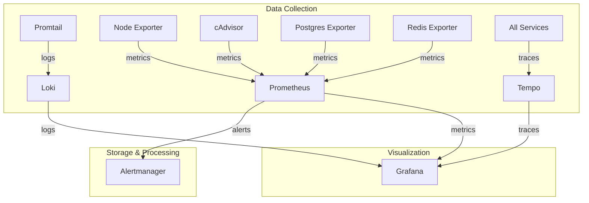

# nself Monitoring Bundle

The nself monitoring bundle provides complete observability for your entire stack with **exactly 10 services**. This is the definitive list of what constitutes the nself monitoring bundle.

## Complete Service List (10 Services)

### 1. Prometheus
**Purpose:** Time-series metrics database and monitoring system
- Collects metrics from all services
- Stores metrics with configurable retention
- Provides PromQL query language
- Port: 9090
- URL: `https://prometheus.<domain>`

### 2. Grafana
**Purpose:** Visualization and dashboards
- Pre-configured dashboards for all services
- Custom dashboard creation
- Alerting visualization
- Port: 3006
- URL: `https://grafana.<domain>`

### 3. Loki
**Purpose:** Log aggregation system
- Horizontally scalable log storage
- LogQL query language
- Integrated with Grafana
- Port: 3100
- Internal use only

### 4. Promtail
**Purpose:** Log shipping agent
- Collects logs from all containers
- Ships logs to Loki
- Automatic service discovery
- Label extraction and filtering
- Port: 9080
- Internal use only

### 5. Tempo
**Purpose:** Distributed tracing backend
- Collects and stores traces
- Integrates with Grafana for visualization
- OpenTelemetry compatible
- Port: 3200
- Internal use only

### 6. Alertmanager
**Purpose:** Alert routing and management
- Routes alerts to various receivers
- Alert grouping and silencing
- Notification channels (email, Slack, webhook)
- Port: 9093
- URL: `https://alertmanager.<domain>`

### 7. cAdvisor
**Purpose:** Container metrics exporter
- Real-time container resource usage
- Container performance metrics
- Docker-specific metrics
- Port: 8080
- Metrics endpoint: `:8080/metrics`

### 8. Node Exporter
**Purpose:** Host/system metrics exporter
- CPU, memory, disk, network metrics
- System-level statistics
- Hardware monitoring
- Port: 9100
- Metrics endpoint: `:9100/metrics`

### 9. Postgres Exporter
**Purpose:** PostgreSQL database metrics
- Database performance metrics
- Query statistics
- Connection pool metrics
- Port: 9187
- Metrics endpoint: `:9187/metrics`
- **Note:** Only enabled when PostgreSQL is enabled

### 10. Redis Exporter
**Purpose:** Redis cache metrics
- Cache hit/miss rates
- Memory usage
- Command statistics
- Port: 9121
- Metrics endpoint: `:9121/metrics`
- **Note:** Only enabled when Redis is enabled

## Architecture Overview



## Enabling the Monitoring Bundle

To enable the complete monitoring bundle, set these in your `.env` file:

```bash
# Master switch for monitoring
MONITORING_ENABLED=true

# Individual service controls (all should be true)
PROMETHEUS_ENABLED=true
GRAFANA_ENABLED=true
LOKI_ENABLED=true
PROMTAIL_ENABLED=true
TEMPO_ENABLED=true
ALERTMANAGER_ENABLED=true
CADVISOR_ENABLED=true
NODE_EXPORTER_ENABLED=true
POSTGRES_EXPORTER_ENABLED=true  # If using PostgreSQL
REDIS_EXPORTER_ENABLED=true      # If using Redis
```

## Default Dashboards

Grafana comes pre-configured with dashboards for:

1. **System Overview** - Overall health and resource usage
2. **Container Metrics** - Per-container resource usage
3. **PostgreSQL** - Database performance and queries
4. **Redis** - Cache performance and memory
5. **Nginx** - Request rates and response times
6. **Custom Services** - Application-specific metrics
7. **Logs Explorer** - Search and analyze logs
8. **Traces** - Distributed tracing visualization

## Resource Requirements

| Component | CPU | Memory | Storage |
|-----------|-----|--------|---------|
| Prometheus | 0.5 cores | 1GB | 10GB |
| Grafana | 0.25 cores | 512MB | 1GB |
| Loki | 0.5 cores | 512MB | 10GB |
| Promtail | 0.1 cores | 128MB | - |
| Tempo | 0.25 cores | 512MB | 5GB |
| Alertmanager | 0.1 cores | 128MB | 100MB |
| cAdvisor | 0.2 cores | 256MB | - |
| Node Exporter | 0.1 cores | 64MB | - |
| Postgres Exporter | 0.1 cores | 64MB | - |
| Redis Exporter | 0.1 cores | 64MB | - |
| **Total** | **~2.5 cores** | **~3.5GB** | **~26GB** |

## Monitoring Ports Reference

| Service | Port | Purpose | External Access |
|---------|------|---------|-----------------|
| Prometheus | 9090 | Web UI & API | Yes (via Nginx) |
| Grafana | 3006 | Web UI | Yes (via Nginx) |
| Loki | 3100 | API | Internal only |
| Promtail | 9080 | Metrics | Internal only |
| Tempo | 3200 | API | Internal only |
| Alertmanager | 9093 | Web UI & API | Yes (via Nginx) |
| cAdvisor | 8080 | Metrics | Internal only |
| Node Exporter | 9100 | Metrics | Internal only |
| Postgres Exporter | 9187 | Metrics | Internal only |
| Redis Exporter | 9121 | Metrics | Internal only |

## Data Retention

Default retention policies:
- **Prometheus metrics:** 15 days
- **Loki logs:** 7 days
- **Tempo traces:** 72 hours

Configure retention in your `.env`:
```bash
PROMETHEUS_RETENTION=15d
LOKI_RETENTION_DAYS=7
TEMPO_RETENTION_HOURS=72
```

## Accessing Monitoring Services

After deployment, access your monitoring stack at:

- **Grafana:** `https://grafana.<domain>`
  - Default user: admin
  - Password: Set via `GRAFANA_ADMIN_PASSWORD`

- **Prometheus:** `https://prometheus.<domain>`
  - No authentication by default

- **Alertmanager:** `https://alertmanager.<domain>`
  - No authentication by default

## Common Monitoring Queries

### Prometheus Queries (PromQL)
```promql
# Container CPU usage
rate(container_cpu_usage_seconds_total[5m])

# PostgreSQL connections
pg_stat_database_numbackends

# Redis memory usage
redis_memory_used_bytes
```

### Loki Queries (LogQL)
```logql
# All error logs
{job="containers"} |= "error"

# Specific service logs
{container="demo-app_hasura"}

# JSON parsing
{job="containers"} | json | level="error"
```

## Troubleshooting

### Prometheus not collecting metrics
- Verify exporters are running
- Check Prometheus targets at `/targets`
- Ensure network connectivity

### Grafana dashboards empty
- Check data source configuration
- Verify Prometheus is running
- Wait for metrics to accumulate

### Logs not appearing in Loki
- Check Promtail is running
- Verify container labels
- Check Promtail configuration

## Important Note

**This is the definitive monitoring bundle specification. Always refer to this document for the exact list of services that constitute the nself monitoring bundle. Do not deviate from this list of 10 services.**

## Related Documentation

- [Services Overview](SERVICES)
- [Optional Services](SERVICES_OPTIONAL)
- [Environment Configuration](ENVIRONMENT-VARIABLES)
- [Architecture Overview](ARCHITECTURE)