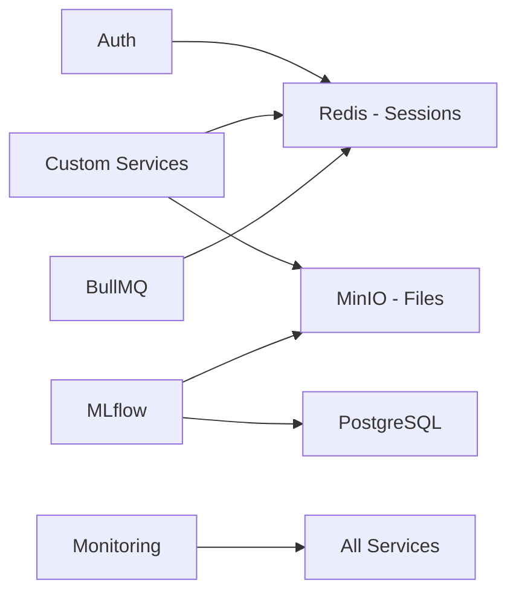

# Optional Services

Optional services extend your nself deployment with additional capabilities. Enable only what you need to keep your stack lean and efficient.

## Service Categories

### [Monitoring Bundle](MONITORING_BUNDLE) (10 services)
Complete observability stack with metrics, logs, traces, and alerting.
**Note:** This is a bundle of 10 optional services that can be enabled together.

### Mail Services
- **MailPit** - Email testing for development
- **SMTP** - Production email sending

### Search Services
- **MeiliSearch** - Fast, typo-tolerant search
- **Typesense** - Lightning-fast search engine
- **Sonic** - Lightweight search backend

### Storage Services
- **MinIO** - S3-compatible object storage
- **nHost Storage** - File management API

### Cache Services
- **Redis** - In-memory data structure store
- **KeyDB** - Redis-compatible with better performance

### Admin Tools
- **[nself Admin](NSELF_ADMIN)** - Web-based nself project management

### ML Services
- **MLflow** - ML experiment tracking
- **Label Studio** - Data labeling platform
- **BentoML** - ML model serving

## Quick Enable Guide

### Development Setup
```bash
# Typical development services
REDIS_ENABLED=true           # Caching and sessions
MAILPIT_ENABLED=true         # Email testing
MEILISEARCH_ENABLED=true     # Search
NSELF_ADMIN_ENABLED=true     # Admin dashboard
```

### Production Setup
```bash
# Production essentials
REDIS_ENABLED=true           # Required for scaling
MINIO_ENABLED=true           # File storage
MONITORING_ENABLED=true      # Full monitoring bundle
```

### Full Demo Setup
```bash
# Everything enabled for testing
MONITORING_ENABLED=true      # All monitoring services
REDIS_ENABLED=true
MINIO_ENABLED=true
MLFLOW_ENABLED=true
MAILPIT_ENABLED=true
MEILISEARCH_ENABLED=true
NSELF_ADMIN_ENABLED=true
```

## Service Details

### Redis
**Purpose:** In-memory caching and session storage
```bash
REDIS_ENABLED=true
REDIS_VERSION=7-alpine
REDIS_PORT=6379
REDIS_PASSWORD=your-redis-password
```
- Used by: Auth service, Custom services, BullMQ
- Memory: 256MB minimum
- Persistence: Optional (AOF/RDB)

### MinIO
**Purpose:** S3-compatible object storage
```bash
MINIO_ENABLED=true
MINIO_VERSION=latest
MINIO_PORT=9000
MINIO_ROOT_USER=minioadmin
MINIO_ROOT_PASSWORD=minioadmin
MINIO_DEFAULT_BUCKETS=uploads,public,private
```
- Web Console: `https://storage-console.<domain>`
- API: `https://storage.<domain>`
- Used for: File uploads, backups, ML artifacts

### MeiliSearch
**Purpose:** Typo-tolerant instant search
```bash
MEILISEARCH_ENABLED=true
MEILISEARCH_VERSION=v1.5
MEILISEARCH_MASTER_KEY=your-master-key-32chars
MEILISEARCH_PORT=7700
```
- Dashboard: `https://search.<domain>`
- Features: Faceting, filtering, synonyms
- Index size: Unlimited documents

### MailPit
**Purpose:** Email testing and debugging
```bash
MAILPIT_ENABLED=true
MAILPIT_SMTP_PORT=1025
MAILPIT_UI_PORT=8025
```
- Web UI: `https://mail.<domain>`
- Catches all outgoing emails
- No emails leave your system

### MLflow
**Purpose:** ML experiment tracking and model registry
```bash
MLFLOW_ENABLED=true
MLFLOW_VERSION=2.9.2
MLFLOW_PORT=5005
MLFLOW_DB_NAME=mlflow
MLFLOW_ARTIFACTS_BUCKET=mlflow-artifacts
```
- UI: `https://mlflow.<domain>`
- Tracks: Parameters, metrics, artifacts
- Model registry included

### [nself Admin](NSELF_ADMIN)
**Purpose:** Comprehensive web-based management interface for your entire nself deployment
```bash
NSELF_ADMIN_ENABLED=true
NSELF_ADMIN_PORT=3100
NSELF_ADMIN_ROUTE=admin.${BASE_DOMAIN}
```
- URL: `https://admin.<domain>`
- Features: Service monitoring, configuration management, database admin, log viewing
- Real-time status updates via WebSocket
- → [Full Documentation](NSELF_ADMIN)

## Resource Impact

| Service | CPU | Memory | Storage | Priority |
|---------|-----|--------|---------|----------|
| Redis | 0.25 cores | 256MB | 1GB | High |
| MinIO | 0.5 cores | 512MB | Unlimited | Medium |
| MeiliSearch | 0.5 cores | 512MB | 5GB | Medium |
| MailPit | 0.1 cores | 128MB | 100MB | Low |
| MLflow | 0.5 cores | 512MB | 10GB | Low |
| nself Admin | 0.25 cores | 256MB | 100MB | Low |
| Monitoring Bundle | 2.5 cores | 3.5GB | 26GB | High |

## Service Dependencies



## Choosing Optional Services

### Do you need Redis?
✅ Yes if:
- Using Auth with sessions
- Need caching
- Using BullMQ for jobs
- Scaling horizontally

❌ No if:
- Single instance deployment
- JWT-only authentication
- No background jobs

### Do you need MinIO?
✅ Yes if:
- Handling file uploads
- Need S3-compatible storage
- Using MLflow
- Want backup storage

❌ No if:
- No file handling
- Using external S3
- Text-only application

### Do you need Monitoring?
✅ Yes if:
- Production deployment
- Need observability
- Want alerts
- Debugging issues

❌ No if:
- Local development only
- Resource constrained
- Using external monitoring

## Configuration Examples

### Minimal (Dev)
```bash
# Just Redis for sessions
REDIS_ENABLED=true
MAILPIT_ENABLED=true
```

### Standard (Staging)
```bash
# Most common services
REDIS_ENABLED=true
MINIO_ENABLED=true
MEILISEARCH_ENABLED=true
MONITORING_ENABLED=true
```

### Complete (Production)
```bash
# Everything you might need
REDIS_ENABLED=true
MINIO_ENABLED=true
MEILISEARCH_ENABLED=true
MONITORING_ENABLED=true
MLFLOW_ENABLED=true
NSELF_ADMIN_ENABLED=true
```

## Related Documentation

- [Services Overview](SERVICES)
- [Required Services](SERVICES_REQUIRED)
- [Custom Services](SERVICES_CUSTOM)
- [Monitoring Bundle](MONITORING_BUNDLE)