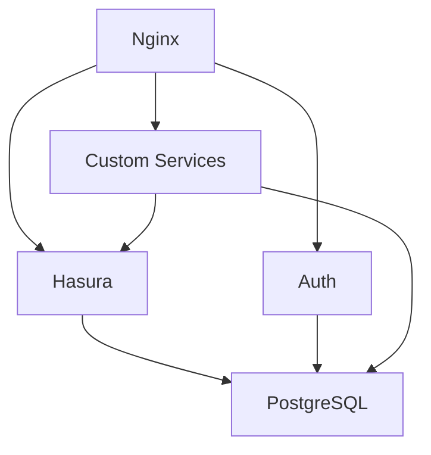

# Required Services

These four services form the core of every nself deployment. They cannot be disabled as they provide essential infrastructure for all other services.

## 1. PostgreSQL

**Purpose:** Primary relational database for all application data

**Details:**
- Version: 16-alpine (default)
- Port: 5432
- Container: `${PROJECT_NAME}_postgres`

**Features:**
- Multiple database schemas for service isolation
- Extensive PostgreSQL extensions enabled:
  - uuid-ossp (UUID generation)
  - pgcrypto (Cryptographic functions)
  - pg_trgm (Trigram text search)
  - pgvector (Vector similarity search)
  - PostGIS (Geospatial data)
  - hstore (Key-value storage)

**Configuration:**
```bash
POSTGRES_ENABLED=true
POSTGRES_VERSION=16-alpine
POSTGRES_DB=myapp_db
POSTGRES_USER=postgres
POSTGRES_PASSWORD=secure-password
POSTGRES_PORT=5432
```

**Initialization:**
- Creates database and schemas
- Sets up extensions
- Configures Hasura metadata tables
- Creates auth schema if AUTH_ENABLED

---

## 2. Hasura GraphQL Engine

**Purpose:** Instant GraphQL API over PostgreSQL with real-time subscriptions

**Details:**
- Version: v2.44.0 (default)
- Port: 8080
- Container: `${PROJECT_NAME}_hasura`
- URL: `https://api.<domain>`

**Features:**
- Auto-generated CRUD APIs
- Real-time subscriptions
- Role-based access control
- Remote schemas and actions
- Event triggers
- Scheduled triggers
- RESTified endpoints

**Configuration:**
```bash
HASURA_ENABLED=true
HASURA_VERSION=v2.44.0
HASURA_GRAPHQL_ADMIN_SECRET=admin-secret
HASURA_GRAPHQL_ENABLE_CONSOLE=true
HASURA_JWT_KEY=jwt-secret-key-32chars
HASURA_JWT_TYPE=HS256
```

**Console Access:**
- Development: `https://api.<domain>/console`
- Admin secret required for access

---

## 3. nHost Auth Service

**Purpose:** Complete authentication and authorization system

**Details:**
- Version: 0.36.0 (default)
- Port: 4000
- Container: `${PROJECT_NAME}_auth`
- URL: `https://auth.<domain>`

**Features:**
- Email/password authentication
- OAuth providers (20+ supported)
- Magic link authentication
- SMS/OTP authentication
- JWT token generation
- Refresh tokens
- Role-based access control
- User management API

**Configuration:**
```bash
AUTH_ENABLED=true
AUTH_VERSION=0.36.0
AUTH_JWT_SECRET=jwt-secret-key-32chars
AUTH_REFRESH_TOKEN_SECRET=refresh-secret
AUTH_ACCESS_TOKEN_EXPIRY=15m
AUTH_REFRESH_TOKEN_EXPIRY=7d
AUTH_CLIENT_URL=http://localhost:3000
```

**Email Configuration:**
```bash
AUTH_SMTP_HOST=mailpit
AUTH_SMTP_PORT=1025
AUTH_SMTP_USER=""
AUTH_SMTP_PASS=""
AUTH_SMTP_SECURE=false
AUTH_SMTP_SENDER=noreply@domain.com
```

---

## 4. Nginx Reverse Proxy

**Purpose:** Traffic routing, SSL termination, and load balancing

**Details:**
- Version: alpine (latest)
- Ports: 80 (HTTP), 443 (HTTPS)
- Container: `${PROJECT_NAME}_nginx`

**Features:**
- SSL/TLS termination
- Automatic HTTPS redirect
- WebSocket support
- Gzip compression
- Security headers
- Rate limiting
- Custom domain routing
- Static file serving

**Configuration:**
```bash
NGINX_ENABLED=true
NGINX_VERSION=alpine
NGINX_HTTP_PORT=80
NGINX_HTTPS_PORT=443
NGINX_CLIENT_MAX_BODY_SIZE=100M
NGINX_GZIP_ENABLED=true
SSL_ENABLED=true
SSL_MODE=local
```

**Route Configuration:**
Routes are automatically configured for all enabled services:
- `api.<domain>` → Hasura
- `auth.<domain>` → Auth service
- `storage.<domain>` → MinIO/Storage
- `<service>.<domain>` → Custom services

---

## Service Dependencies



## Health Checks

All required services include health checks:

| Service | Health Check Endpoint | Expected Response |
|---------|----------------------|-------------------|
| PostgreSQL | `pg_isready` command | Exit code 0 |
| Hasura | `/healthz` | HTTP 200 |
| Auth | `/healthz` | HTTP 200 |
| Nginx | `/health` | HTTP 200 |

## Resource Allocation

### Minimum Requirements
- CPU: 2 cores
- RAM: 2GB
- Storage: 1GB

### Recommended
- CPU: 4 cores
- RAM: 4GB
- Storage: 10GB

## Troubleshooting

### PostgreSQL Won't Start
- Check port 5432 availability
- Verify password complexity
- Check disk space for volumes

### Hasura Connection Failed
- Verify PostgreSQL is healthy
- Check database credentials
- Ensure database exists

### Auth Service Errors
- Check JWT secret length (min 32 chars)
- Verify PostgreSQL connection
- Check SMTP configuration

### Nginx Bad Gateway
- Ensure target services are running
- Check service names in upstream
- Verify network connectivity

## Related Documentation

- [Services Overview](SERVICES)
- [Optional Services](SERVICES_OPTIONAL)
- [Environment Configuration](ENVIRONMENT-VARIABLES)
- [Architecture Overview](ARCHITECTURE)